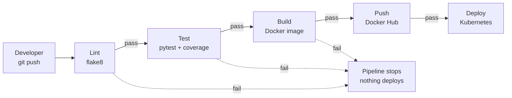
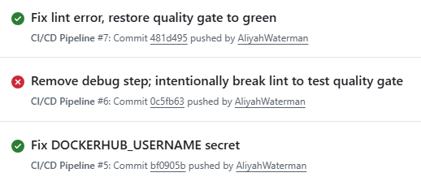
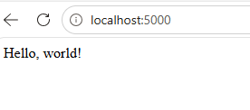

# SkyHigh Portfolio Project 04 — Automated CI/CD Pipeline

## Project Description

A fully automated CI/CD pipeline built with GitHub Actions that takes a Flask web application from `git push` to a running deployment in Kubernetes — no manual steps, no manual SSH, and no code reaches production unless it passes lint checks and unit tests first.

Every push to `main` triggers the pipeline automatically: the code is linted, tested, packaged into a Docker image, pushed to Docker Hub, and rolled out to a Kubernetes cluster — each stage gated behind the success of the one before it.

## Architecture

Each stage only runs if the previous stage succeeded (`needs:` in the workflow file). A broken lint check or a failing test stops the pipeline immediately — no broken code can reach the cluster.

## Tech Stack

- **GitHub Actions** — pipeline orchestration (4-stage workflow: lint, test, build, deploy)
- **Python / Flask** — the sample web application
- **Pytest + pytest-cov** — unit testing and coverage reporting
- **flake8** — code style / lint enforcement
- **Docker** — containerizing the application
- **Docker Hub** — container registry
- **Kubernetes (kind)** — deployment target
- **Self-hosted GitHub Actions runner** — executes the deploy stage locally against the Kubernetes cluster

## How the Pipeline Works

1. **Lint** — Runs `flake8` against the codebase on a GitHub-hosted Ubuntu runner. Catches style violations before anything else runs. If this fails, nothing downstream executes.
2. **Test** — Installs dependencies and runs the Pytest suite with coverage reporting (`pytest --cov`). Only starts if lint passed.
3. **Build & Push** — Logs into Docker Hub using credentials stored in GitHub Actions Secrets, builds the Docker image, and pushes it with two tags: `latest` and a versioned tag (`v1.0.<run number>`) so every build is traceable back to its pipeline run.
4. **Deploy** — Runs on a **self-hosted runner** (my own machine), since the Kubernetes cluster is a local `kind` cluster not reachable from GitHub's cloud infrastructure. This stage only runs on pushes to `main` (not pull requests) and uses `kubectl set image` to roll the newly built image into the running deployment, then waits for the rollout to complete.

All credentials (Docker Hub username/token) are stored in GitHub Actions Secrets and referenced through the `secrets` context — never hardcoded or printed in logs.

## Screenshots

**Pipeline run history — showing a failed lint stage (gate working) followed by successful runs:**

**Deployed app running (served from the Kubernetes pod via `kubectl port-forward`):**

## Challenges & Solutions

- **Docker Hub authentication kept failing with a "malformed HTTP Authorization header" error**, even after regenerating the access token multiple times. The token worked perfectly when tested locally with `docker login`, which pointed away from the credentials themselves and toward how they were stored. Added a temporary debug step to the workflow that printed the *length* of each secret (never the value) — this revealed the `DOCKERHUB_USERNAME` secret was 27 characters long instead of the expected 11, meaning extra characters had been pasted into the GitHub secret field at some point. Clearing the field completely and retyping the username manually (rather than pasting) fixed it immediately.
- **Local Kubernetes cluster (`kind`) isn't reachable from GitHub's cloud-hosted runners.** Solved by setting up a self-hosted GitHub Actions runner on my own machine, which has local network access to the cluster's API server — the deploy job runs there instead of on GitHub's infrastructure.
- **Trailing-newline issues in local files** caused repeated flake8 `W292`/`W391` failures during local testing, resolved by enabling "Insert Final Newline" in the editor and trimming files to exactly one trailing newline.

## What I'd Do Differently in Production

- **Cloud-hosted Kubernetes cluster (EKS/GKE) instead of a local `kind` cluster** — a self-hosted runner tied to a personal laptop is a fine shortcut for a portfolio project, but it means deployments only work while that machine is on. A production setup would deploy to a cluster reachable over the network from GitHub's own runners, removing that dependency entirely.
- **Blue/green or canary deployments** instead of a direct rolling update, to reduce risk during releases and allow instant rollback if a new version misbehaves.
- **Require PR review before merging to `main`**, so no single push can trigger a production deployment without a second set of eyes.
- **Add a security scanning stage** (e.g. `trivy` for the Docker image) as an additional quality gate before deploy.
- **Slack notifications** on pipeline success/failure, so the team knows the state of `main` without checking GitHub directly.
